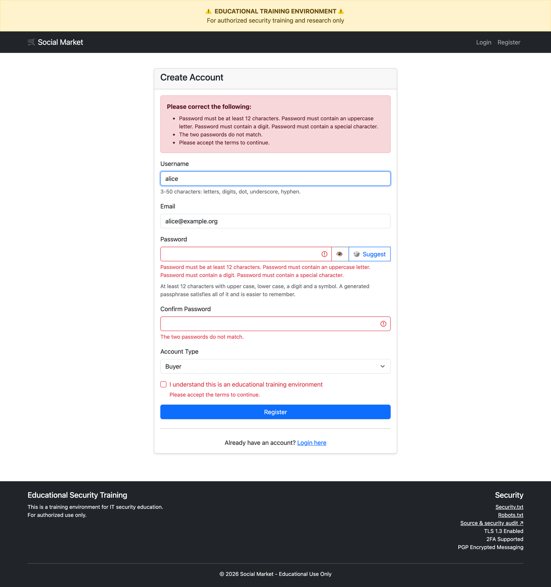
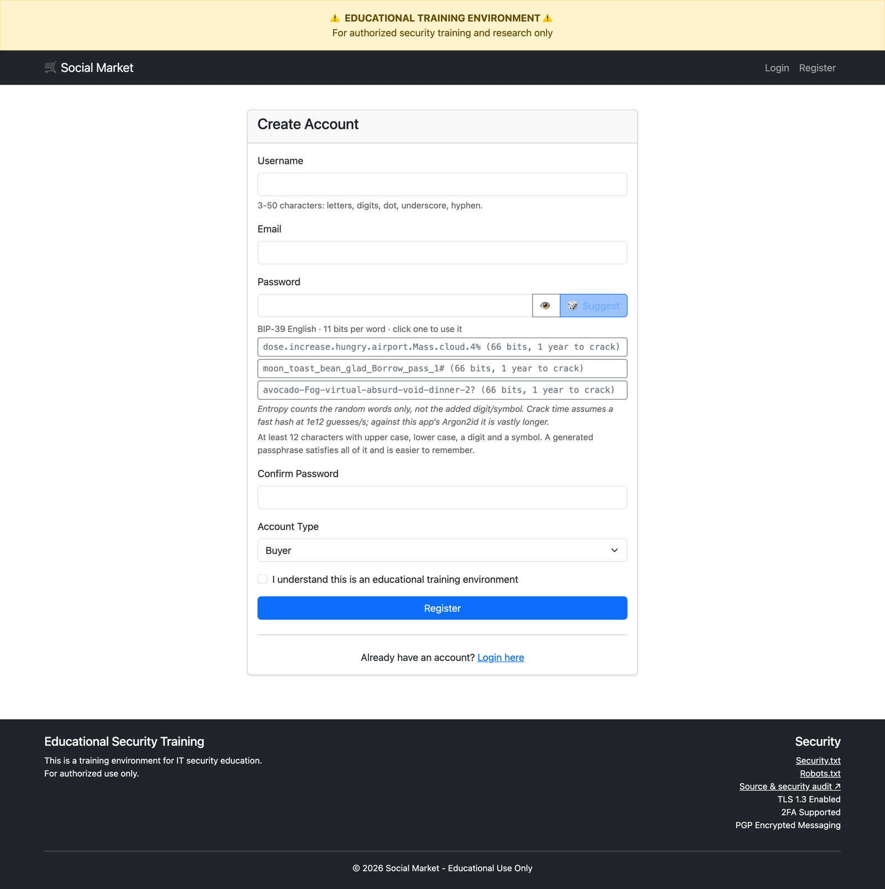
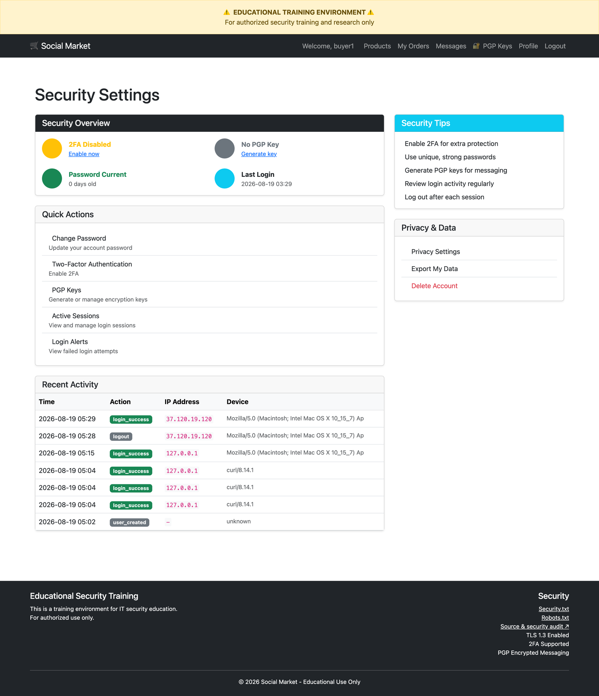
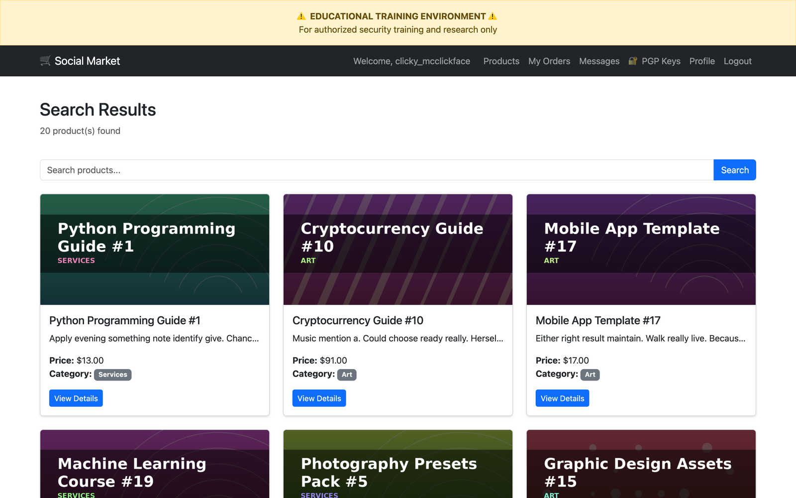
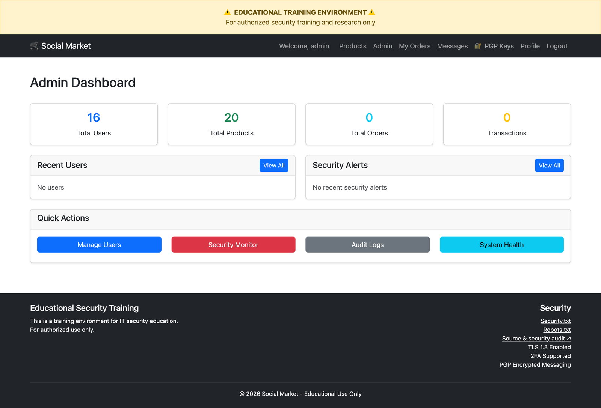
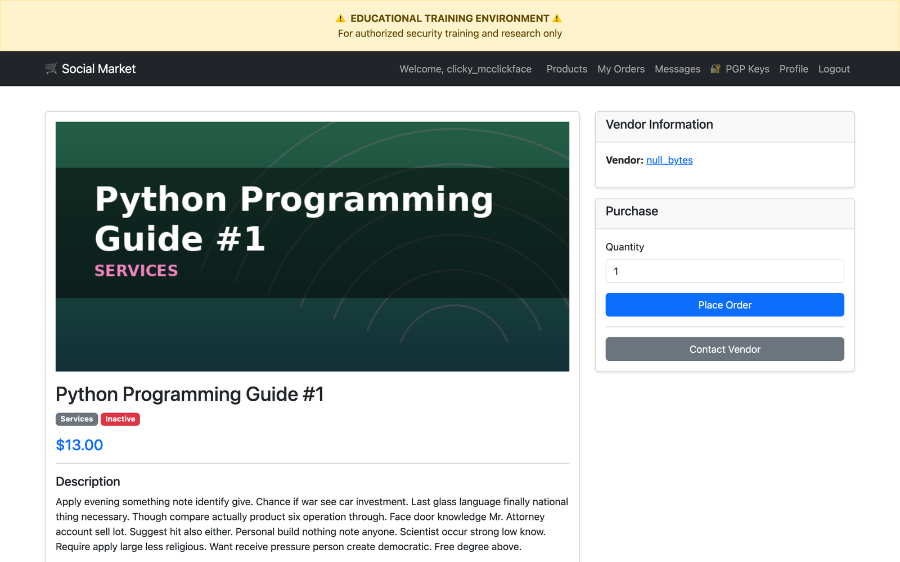
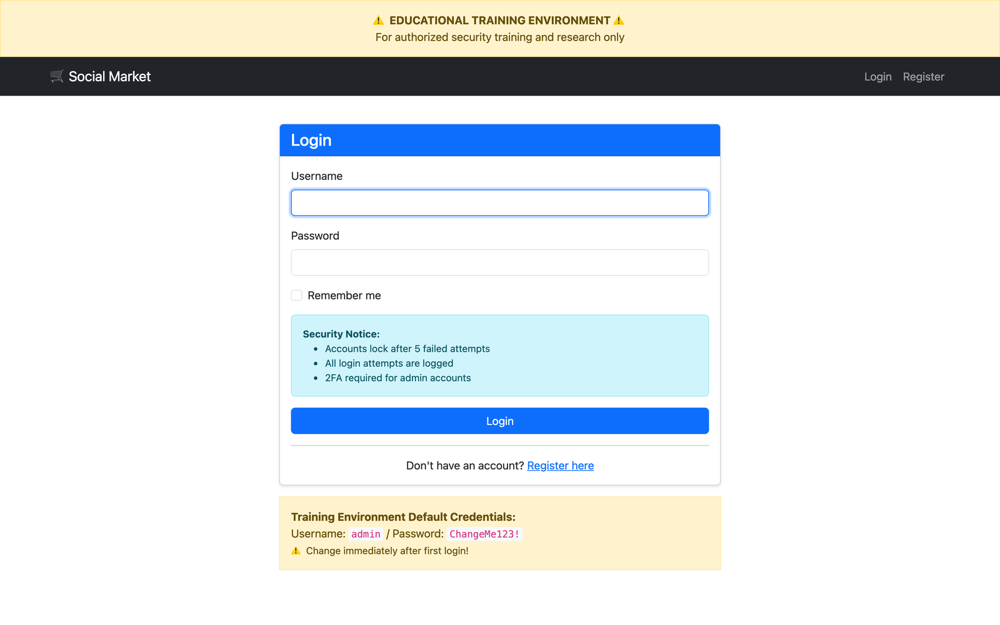
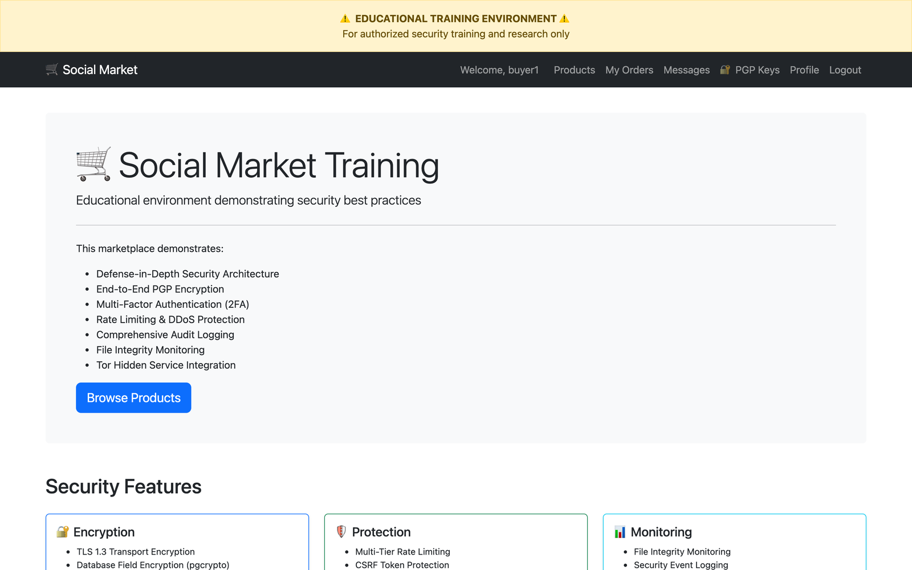
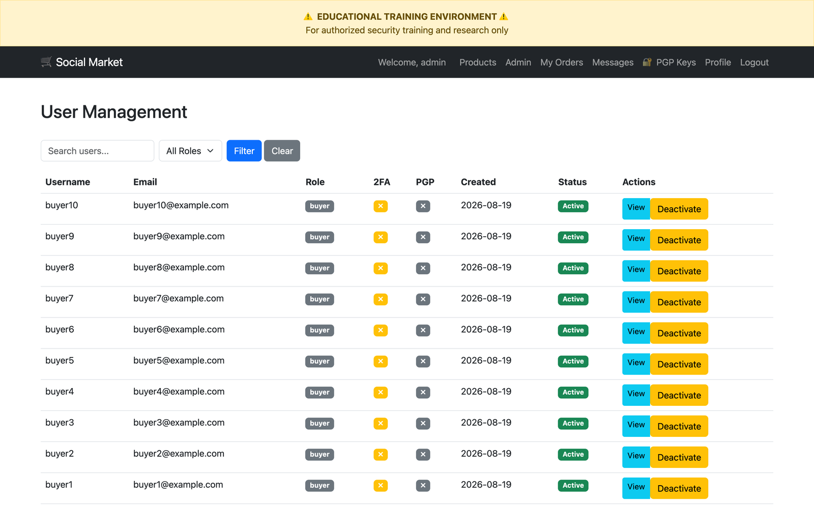

<div align="center">

# 🔵 Social Market — Blue Team Training Environment

**A deliberately well-built marketplace you are meant to take apart, read, and learn defence from.**

*Defense-in-depth, written out in full — then audited, broken, and fixed in the open.*

<!-- Build & quality -->
[](https://github.com/pepperonas/social-market/actions/workflows/ci.yml)
[](tests/)
[](tests/)
[](.flake8)
[](.github/workflows/ci.yml)
[](.github/workflows/ci.yml)
[](.gitleaks.toml)
[](CONTRIBUTING.md)
[](tests/test_query_performance.py)
[](.github/workflows/ci.yml)

<!-- Repository -->
[](https://github.com/pepperonas/social-market/commits/main)
[](https://github.com/pepperonas/social-market/pulse)
[](https://github.com/pepperonas/social-market)
[](https://github.com/pepperonas/social-market)
[](https://github.com/pepperonas/social-market/issues)
[](https://github.com/pepperonas/social-market/stargazers)

<!-- Stack -->
[](https://www.python.org/)
[](https://flask.palletsprojects.com/)
[](https://www.sqlalchemy.org/)
[](https://www.postgresql.org/)
[](https://redis.io/)
[](https://docs.celeryq.dev/)
[](https://gunicorn.org/)
[](nginx/)
[](https://docs.docker.com/compose/)
[](https://getbootstrap.com/)

<!-- Security posture -->
[](docs/PASSWORD_SECURITY.md)
[](app/services/passphrase_service.py)
[](docs/PGP_KEYS.md)
[](app/models/user.py)
[](app/__init__.py)
[](app/__init__.py)
[](app/__init__.py)
[](postgres/)
[](app/__init__.py)
[](postgres/audit-logging.sql)
[](tor/)
[](https://socialmarket.celox.io/.well-known/security.txt)
[](#-owasp-top-10-where-to-look)
[](DEPLOY.md)
[](app/__init__.py)
[](app/services/image_service.py)
[](app/services/cover_service.py)
[](tests/test_models_order.py)
[](app/models/user.py)
[](tests/test_code_block_readability.py)

<!-- Project -->
[](#-what-this-is-for)
[](#%EF%B8%8F-what-this-is-not-for)
[](https://socialmarket.celox.io)
[](LICENSE)
[](CONTRIBUTING.md)
[](SECURITY.md)
[](https://github.com/pepperonas/social-market/commits/main)
[](https://celox.io)
[](docs/BUGFIX-PLAN.md)

</div>

---

## 🌐 Live demo

**[socialmarket.celox.io](https://socialmarket.celox.io)** — a running instance you can log
into and click through while reading the code.

| Role | Username | Password |
|---|---|---|
| Admin | `admin` | `ChangeMe123!` |
| Buyer | any of the ten below | `Password123!` |
| Vendor | any of the five below | `Password123!` |

<details>
<summary><strong>The cast</strong> — every demo account is also a teaching example</summary>

**Buyers** — the people your awareness programme is actually for:

| Username | Who they are |
|---|---|
| `clicky_mcclickface` | Has never met a link he would not click |
| `bob_from_accounting` | 40 invoices a day, three of them real |
| `password_pete` | Same password everywhere. It is the cat's name plus a year |
| `sudo_susan` | Believes any problem yields to running it again with `sudo` |
| `two_factor_tina` | 2FA on everything, including the microwave. The one you want |
| `phishy_phil` | Wired money to a prince once; now runs the training |
| `cache_money` | Never invalidates anything. Still seeing Tuesday's prices |
| `patch_tuesday` | Reboots religiously once a month |
| `cookie_monster` | Accepts all cookies. ALL of them |
| `admin_admin` | Left the default credentials on the router |

**Vendors:**

| Username | Who they are |
|---|---|
| `salt_n_peppa` | Salt goes in the database, pepper stays in the environment |
| `zero_cool` | Retired 1995 teen hacker, now entirely legitimate |
| `null_bytes` | Terminates everything early |
| `entropy_ella` | Rolls actual dice. Refuses anything from `Math.random()` |
| `rubber_ducky` | Listens patiently while you solve your own bug |

</details>

**Read this before you poke at it:**

- The data is **disposable and fictional**. No real transactions, no real personal data,
  no real payments. It is reset whenever it needs to be.
- Every account above is **public on purpose** — being able to walk the whole role model,
  admin included, *is* the teaching value. There is nothing behind them worth stealing.
- Account lockout is live: five wrong passwords lock an account for 15 minutes. If the demo
  admin is locked when you arrive, someone was guessing — wait it out, that is the control
  doing its job.
- It is `noindex, nofollow` and is **not** a hardened production system. The README section
  below explains exactly what it is not.
- Please do not run automated scanners or load against it. If you want to attack something,
  clone the repo and attack your own copy — that is what it is for, and you get a debugger.

---

## 📸 What it looks like

<table>
<tr>
<td width="50%">

**Registration — every problem at once, nothing wiped**



All violations are reported in one pass instead of one per submission. Username,
email, account type and the terms checkbox survive a rejection — but the password
fields are deliberately cleared, because re-rendering a password puts it in the
DOM and the browser's back/forward cache.

</td>
<td width="50%">

**Password suggestions with a defensible number**



Passphrases drawn from the BIP-39 wordlist with `secrets`, server-side. The
strength shown is `11 bits × words` — and it counts **only** the random words,
not the digit and symbol appended to satisfy composition rules. Overstating that
is what makes most strength meters worthless.

</td>
</tr>
<tr>
<td width="50%">

**Security overview**



2FA state, password age, recent authentication events. This page returned a 500
in production until 2026-08-19: it sliced `user_agent[:50]` and the audit rows
written by the SQLAlchemy listeners have no user agent. Found by clicking, not
by testing — now pinned by `tests/test_templates_null_safety.py`.

</td>
<td width="50%">

**Marketplace**



Twenty seeded products across five vendors. The storefront is login-gated by
design — a closed marketplace, which is what makes the role separation
interesting to study.

</td>
</tr>
<tr>
<td width="50%">

**Admin dashboard**



Reachable in the demo on purpose, so the whole role model can be explored.
`tests/test_authorization_matrix.py` walks every role against every protected
route to prove the separation holds.

</td>
<td width="50%">

**Product detail**



Escrow-backed ordering. The order state machine
(`tests/test_models_order.py`) is where "insecure design" stops being an
abstract OWASP category: every illegal transition it fails to reject is a way to
get goods without paying.

</td>
</tr>
</table>

<details>
<summary>More screenshots</summary>

| | |
|---|---|
| Login |  |
| Home |  |
| Admin: users |  |

</details>

---

## 🔵 What this is for

This repository exists so that **defenders can read a complete, non-trivial application
end to end** — not a toy with three routes, and not a deliberately vulnerable app where
every bug is planted and signposted.

It is a marketplace because marketplaces are hard: money, escrow, private messages,
shipping addresses, role separation, file uploads, and a strong incentive for everyone
involved to cheat. Every one of those is a place where defence is *interesting*.

**You are meant to:**

| | |
|---|---|
| 📖 **Read the controls** | Argon2id + pepper, nonce-based CSP, TOTP with replay protection, encrypted shipping data, an escrow state machine, audit logging via stored procedures |
| 🧪 **Read the tests** |  of them. They are written as *arguments*, not assertions — each says why a control matters and what breaks without it |
| 🔍 **Read the audit** | [`docs/BUGFIX-PLAN.md`](docs/BUGFIX-PLAN.md) is a real security review of this codebase, with the real findings, in the order they were found |
| 🛠 **Break it on purpose** | Revert a fix and watch which test screams. Every fix in the audit has a test that provably catches its regression |
| 📉 **Study the failures** | The most valuable parts of this repo are the places where it *was wrong* — documented rather than quietly rewritten |

### 🎓 Start here

1. **[`docs/BUGFIX-PLAN.md`](docs/BUGFIX-PLAN.md)** — the security review. 13 findings, from an
   authentication bypass to a test suite that had never once executed.
2. **[`docs/PASSWORD_SECURITY.md`](docs/PASSWORD_SECURITY.md)** — includes a worked example of a
   *real* secret that leaked through documentation for 19 commits.
3. **[`tests/test_authorization_matrix.py`](tests/test_authorization_matrix.py)** — every role
   against every protected route. Broken access control, made visible.
4. **[`tests/test_query_performance.py`](tests/test_query_performance.py)** — N+1 queries as a
   denial-of-service surface, pinned by counting SQL statements.

### 🧠 Lessons this codebase teaches the hard way

Not hypotheticals. Each one happened *here*, and the fix is in the history:

- **A test suite that cannot run is worse than no test suite.** All 408 tests errored on setup
  for months while CI reported the failure into a void. Four stacked defects, each hidden by
  the one before it.
- **Secrets leak through documentation.** The live password pepper sat in a Markdown file whose
  own next line read *"never commit to git!"*.
- **A green test can be green for the wrong reason.** One lockout test passed only because the
  data it wrote was silently discarded — the control it "verified" did not exist.
- **Order of checks is a security boundary.** `if 2fa_enabled` was evaluated before
  `if account_is_active`, so deactivating an account did not deactivate it.
- **Configuration that is never loaded enforces nothing.** A 12-character password policy sat
  in config while the code checked for 8.
- **Money is not a float.** `Decimal * float` raised `TypeError` in an insert listener, so every
  real checkout failed — invisible, because nothing tested order creation.
- **A field-name typo can disable a whole feature silently.** The terms checkbox was named
  `terms`; the route read `terms_accepted`. Every registration through the web UI was rejected
  with "you must accept the terms" — and the tests never caught it, because they posted the
  form field directly instead of the form the browser sends.
- **Behind a proxy, everyone shares one IP.** `request.remote_addr` was `127.0.0.1` for every
  visitor, so the rate limiter put them all in one bucket and the audit log recorded nginx
  rather than the client. The fix is opt-in on purpose: trusting `X-Forwarded-For` without a
  known hop count lets anyone forge their source address.
- **A page that 500s on incomplete audit data fails when it is needed.** `/account/security`
  crashed on `user_agent[:50]` because the audit rows written by the model listeners carry no
  user agent — and that page is exactly what a defender opens when something looks wrong.
- **A rate limit on static assets is a self-inflicted outage.** The global 10/s limit throttled
  the app's own product covers: a listing page pulls twenty, so half came back `429` and the
  grid rendered blank. A limit exists to bound expensive or abusable work.
- **Forcing a text colour without declaring `::selection` breaks copying.** White commands on a
  dark block met the browser's light-grey selection highlight — unreadable at the exact moment
  someone selected them to copy.
- **A feature can ship having never worked.** Product images had no route serving them and the
  templates interpolated the ORM object into `src`. Nobody noticed, because no product had an
  image to reveal it.

### 🗺 OWASP Top 10: where to look

| OWASP category | Where it lives here |
|---|---|
| A01 Broken Access Control | [`test_authorization_matrix.py`](tests/test_authorization_matrix.py), `@admin_required` / `@vendor_required` |
| A02 Cryptographic Failures | [`password_service.py`](app/services/password_service.py), [`crypto_service.py`](app/services/crypto_service.py), pgcrypto columns |
| A03 Injection | Parameterised queries throughout; [`test_security_regressions.py`](tests/test_security_regressions.py) |
| A04 Insecure Design | Escrow + order state machine ([`test_models_order.py`](tests/test_models_order.py)) |
| A05 Security Misconfiguration | [`test_security_headers.py`](tests/test_security_headers.py), `.flake8`, CI |
| A07 Auth Failures | [`test_two_factor.py`](tests/test_two_factor.py) — enrolment, replay, lockout |
| A09 Logging Failures | [`audit_service.py`](app/services/audit_service.py) + PostgreSQL stored procedures |

---

## ⚠️ What this is NOT for

This is a **defensive** teaching artifact. To be unambiguous:

- ❌ **Not a template for running a real marketplace.** It is not hardened for adversarial
  production traffic, and it never will be.
- ❌ **Not for illegal activity of any kind.** No feature here exists to enable one.
- ❌ **Not for processing real transactions, real payments, or real personal data.**
- ❌ **Not an offensive tool.** There is no exploit code here, and contributions adding any
  will be declined.

Any public instance of this project is a **read-only teaching demo** with disposable data.
Treat every credential in this repository as public knowledge, because it is.

**Legal context:** authorised security education material, published for defensive
security purposes.

---

## Overview

This project implements a fully-featured, security-hardened marketplace platform that demonstrates:

- **Defense-in-Depth Architecture** - Multiple layers of security controls
- **Zero-Trust Security Model** - Verify everything, trust nothing
- **Argon2id Password Hashing** - Memory-hard, GPU-resistant with pepper
- **RSA-4096 PGP Key Generation** - Web-based keypair generation
- **Encryption at Rest & in Transit** - pgcrypto, TLS 1.3, PGP messaging
- **Secure Session Management** - Redis-backed, HTTPOnly cookies
- **Rate Limiting & DDoS Protection** - Multi-tier rate limiting
- **Input Validation & Injection Prevention** - Parameterized queries, sanitization
- **Audit Logging & Monitoring** - Complete audit trail
- **Network Isolation** - Tor hidden service support
- **File Integrity Monitoring** - AIDE-style hash verification
- **Secure Backup Strategies** - GPG-encrypted backups

## Technology Stack

### Backend
- Python 3.11 + Flask (lightweight, security-focused)
- PostgreSQL 15 with pgcrypto extension
- Redis for session management
- Celery for async task processing

### Security & Crypto
- **Argon2id** for password hashing (Winner of Password Hashing Competition)
  - Memory-hard: 64 MB per hash (GPU/ASIC resistant)
  - Time-cost: 3 iterations (~0.2-0.5s per hash)
  - Pepper: Secret server-side salt for additional security
- **RSA-4096 PGP** key generation (OpenPGP standard)
- **pgcrypto** for database field encryption
- **python-gnupg** for PGP messaging
- **cryptography** library for Python crypto operations

### Infrastructure
- Docker Compose for all services
- Nginx reverse proxy with TLS 1.3
- Tor hidden service (v3 onions)
- Fail2Ban for rate limiting

## Quick Start

### Prerequisites

- Docker & Docker Compose
- At least 4GB RAM
- 10GB disk space

### Setup

1. **Clone and configure environment:**
   ```bash
   cd secure-marketplace
   cp .env.example .env
   # Edit .env with secure random values
   ```

2. **Generate secure secrets:**
   ```bash
   python3 -c "import secrets; print(secrets.token_hex(32))"  # For SECRET_KEY
   python3 -c "import secrets; print(secrets.token_hex(32))"  # For DB_ENCRYPTION_KEY
   python3 -c "import secrets; print(secrets.token_hex(32))"  # For PASSWORD_PEPPER
   ```

   Update `.env` with generated values

3. **Build and start services:**
   ```bash
   docker-compose up -d
   ```

4. **Initialize database:**
   ```bash
   docker-compose exec app flask db upgrade
   docker-compose exec app flask init-db
   ```

5. **Access the application:**
   - HTTP: http://localhost:8080
   - Tor: Check logs for .onion address
     ```bash
     docker-compose logs tor | grep "hostname"
     ```

### Default Accounts

| Role | Username | Password |
|------|----------|----------|
| **Admin** | `admin` | `ChangeMe123!` |
| **Buyers** | `buyer1` - `buyer10` | `Password123!` |
| **Vendors** | `vendor1` - `vendor5` | `Password123!` |

⚠️ **Change passwords immediately in production environments!**

- **Login:** http://localhost:8080/auth/login
- **Admin Panel:** http://localhost:8080/admin

## Architecture

```
Internet (Tor)
     ↓
  Tor Hidden Service (isolated network)
     ↓
  Nginx (TLS 1.3, Security Headers, Rate Limiting)
     ↓
  Flask App (Gunicorn workers)
     ↓
  ├─→ PostgreSQL (pgcrypto, RLS, audit logs)
  ├─→ Redis (sessions, cache, rate limit counters)
  └─→ Celery (escrow processing, monitoring tasks)
```

## Security Features

### Application Security
- **Argon2id Password Hashing:**
  - Memory-hard algorithm (64 MB per hash)
  - GPU/ASIC attack resistance
  - Pepper + salt protection
  - Automatic migration from legacy hashes
  - OWASP & NIST compliant
- **PGP Key Generation:**
  - RSA-4096 keypair generation
  - Web-based key creation
  - OpenPGP standard compatible
  - Strong passphrase validation
  - No server-side key storage
- **Security Headers:** CSP (nonce-based, with violation reporting), HSTS, X-Frame-Options, X-Request-ID
- **Rate Limiting:** Multi-tier (general, login, registration, PGP: 3/hour)
- **CSRF Protection:** Token-based for all state-changing operations
- **Input Validation:** SQLAlchemy ORM, Werkzeug sanitization
- **Session Security:** HTTPOnly, Secure, SameSite cookies, session invalidation on password change
- **Open Redirect Prevention:** URL validation on login redirects
- **DB SSL:** `sslmode: prefer` for database connections

### Database Security
- **Least Privilege:** App user has minimal permissions
- **Row-Level Security:** Users can only access their own data
- **Field Encryption:** Sensitive data encrypted with pgcrypto
- **Audit Logging:** All DB changes logged with timestamps

### Network Security
- **TLS 1.3 Only:** Modern cipher suites
- **Tor Hidden Service:** Network anonymity layer
- **Rate Limiting:** Nginx + Redis-backed counters
- **DDoS Protection:** Connection limits, request throttling

### Monitoring & Detection
- **File Integrity Monitoring:** SHA256 hash verification
- **Security Monitoring:** Service health, failed logins, disk usage
- **Audit Logs:** Complete trail of all actions
- **Alerting:** Automated alerts for security events

## Core Features

### User Management
- **Multi-role system:** Vendor/Buyer/Admin with distinct permissions
- **Argon2id password hashing:**
  - Memory-hard algorithm (64 MB per hash)
  - Pepper + salt protection
  - GPU/ASIC attack resistance
  - Automatic migration from legacy hashes
- **RSA-4096 PGP key generation:**
  - Web-based keypair creation
  - 2048/3072/4096-bit options
  - Strong passphrase validation
  - No server-side storage
  - OpenPGP standard compatible
- **2FA via TOTP:** Time-based one-time passwords
- **Account security:**
  - Failed login attempt tracking
  - Account lockout (5 attempts, 15 min)
  - Session management with Redis

### Marketplace
- Product listings (legal categories only: Books, Art, Digital Goods, Services)
- Search functionality with SQL injection protection
- Rating/review system
- Vendor analytics dashboard

### Escrow System
- Multi-signature wallet simulation (educational mock)
- Order states: pending → paid → shipped → completed → released
- Dispute handling
- Auto-release mechanism
- Commission calculation (3%)

### Messaging System
- **Mandatory PGP encryption:** All messages MUST be encrypted (no plaintext allowed)
- **Two encryption modes:**
  - Auto-encrypt: System encrypts with recipient's public key
  - Manual: User provides pre-encrypted PGP message
- **Flexible communication:**
  - Admin ↔ All users (support/moderation)
  - Vendor ↔ Buyers (customer service)
  - Users ↔ Admin (support requests)
- **Zero-knowledge architecture:** Messages stored encrypted, server cannot decrypt
- **Message threading:** Organized conversations per participant pair
- **Auto-deletion:** Messages expire after 30 days (OPSEC)
- **Soft delete:** Per-user deletion, permanent only when both delete
- **Rate limiting:** 10 new threads/hour, 20 replies/hour
- **AJAX decryption:** User provides private key to decrypt in browser
- See `docs/MESSAGING.md` for complete documentation

### Admin Dashboard
- User management (activate/deactivate, unlock locked accounts, approve vendors)
- Transaction monitoring
- Security alerts dashboard (with rate-limit breach tracking)
- Real-time system health checks (DB latency, Redis, disk, memory, Celery)
- Audit log viewer (auth, security, admin, general)
- CSP violation reporting

## Backup & Recovery

Automated encrypted backups:

```bash
# Run backup manually
docker-compose exec app python /app/scripts/backup.sh

# Restore from backup
docker-compose exec app python /app/scripts/restore.sh backup_20250127_120000.tar.gz.gpg
```

Backups are:
- Encrypted with GPG (AES256)
- Stored in `/backups` volume
- Retained for 7 days
- Include database dump + critical files

## Monitoring

### File Integrity Monitoring

```bash
# Create baseline
docker-compose exec app python /app/monitoring/file_integrity_monitor.py --baseline

# Check for changes
docker-compose exec app python /app/monitoring/file_integrity_monitor.py --check
```

### Security Monitoring

```bash
# View security status
docker-compose exec app python /app/monitoring/security_monitor.py --status

# View recent alerts
docker-compose exec app python /app/monitoring/security_monitor.py --alerts
```

### Logs

```bash
# Application logs
docker-compose logs -f app

# Nginx access/error logs
docker-compose logs -f nginx

# PostgreSQL logs
docker-compose logs -f postgres

# Tor logs
docker-compose logs -f tor
```

## Testing

### Security Headers
```bash
curl -I http://localhost:8080 | grep -E "X-Frame|CSP|HSTS"
```

### Rate Limiting
```bash
# Should see 429 responses after limit exceeded
for i in {1..20}; do curl -s -o /dev/null -w "%{http_code}\n" http://localhost:8080/; done
```

### Database Encryption
```bash
docker-compose exec postgres psql -U marketplace -d marketplace -c \
  "SELECT pgp_sym_encrypt('test message', current_setting('app.encryption_key'));"
```

### Tor Connectivity
```bash
# Get .onion address
ONION=$(docker-compose exec tor cat /var/lib/tor/hidden_service/hostname)

# Test via Tor
curl --socks5-hostname localhost:9050 http://$ONION
```

## Development

### Run tests
```bash
# Run full test suite
docker-compose exec app pytest tests/ -v

# Run with coverage
docker-compose exec app pytest tests/ -v --cov=app --cov-report=term-missing

# Run specific test file
docker-compose exec app pytest tests/test_auth.py -v

# Run locally (uses SQLite in-memory)
cd secure-marketplace && pytest tests/ -v
```

### Security Scanning
```bash
# Run automated security scan
./scripts/security-scan.sh

# Dependency vulnerability scan
pip-audit -r app/requirements.txt
```

### CI/CD Pipeline

The project includes a GitHub Actions CI/CD pipeline (`.github/workflows/ci.yml`) with three jobs:

| Job | Tools | Purpose |
|-----|-------|---------|
| **Lint** | flake8, bandit | Code quality + security static analysis |
| **Test** | pytest (PostgreSQL + Redis) | Full test suite with coverage |
| **Security** | pip-audit | Dependency vulnerability scanning |

### Access PostgreSQL
```bash
docker-compose exec postgres psql -U marketplace
```

### Access Redis CLI
```bash
docker-compose exec redis redis-cli
```

### Rebuild after code changes
```bash
docker-compose down
docker-compose up -d --build
```

## Training Scenarios

See `docs/TRAINING-GUIDE.md` for:
- Security audit exercises
- Penetration testing scenarios (authorized only)
- Incident response drills
- Code review challenges
- Configuration hardening tasks

## Documentation

### Core Documentation
- `docs/ARCHITECTURE.md` - Detailed system architecture
- `docs/SECURITY.md` - Security controls and threat model
- `SETUP.md` - Comprehensive setup guide

### Security Features
- **`docs/PASSWORD_SECURITY.md`** - Argon2id password hashing with pepper
  - Algorithm explanation
  - Security comparison vs other algorithms
  - Best practices for pepper management
  - Migration strategy
  - Threat model and attack defenses
  - Performance considerations
  - Compliance (OWASP, NIST, PCI-DSS, GDPR)

- **`docs/PGP_KEYS.md`** - RSA-4096 PGP key generation
  - Web-based key generation guide
  - Security features and best practices
  - Import instructions for various clients
  - Use cases (email, files, signatures)
  - Troubleshooting

- **`docs/MESSAGING.md`** - Encrypted messaging system
  - Mandatory PGP encryption architecture
  - Auto-encrypt vs manual modes
  - Communication matrix (who can message whom)
  - Zero-knowledge design
  - Database schema and API endpoints
  - Security best practices and troubleshooting

### User Guides
- `LOGIN_CREDENTIALS.md` - Default accounts and access information

## Troubleshooting

### Services won't start
```bash
# Check logs
docker-compose logs

# Verify ports not in use
sudo lsof -i :8080,5432,6379,9050
```

### Database connection errors
```bash
# Verify PostgreSQL is ready
docker-compose exec postgres pg_isready

# Check credentials in .env
```

### Tor hidden service not working
```bash
# Check Tor logs
docker-compose logs tor

# Verify hostname file exists
docker-compose exec tor cat /var/lib/tor/hidden_service/hostname
```

## Security Hardening Checklist

Before deployment (even locally):

- [ ] Change default admin password
- [ ] Generate new SECRET_KEY and DB_ENCRYPTION_KEY
- [ ] Review and customize rate limits
- [ ] Configure backup encryption passphrase
- [ ] Enable file integrity monitoring
- [ ] Review audit log retention policy
- [ ] Test emergency shutdown procedure
- [ ] Verify all services start correctly
- [ ] Run security header checks
- [ ] Test rate limiting effectiveness

## Emergency Procedures

### Shutdown all services
```bash
docker-compose down
```

### Emergency data wipe (IRREVERSIBLE)
```bash
docker-compose down -v  # Removes all volumes/data
```

### Dead Man's Switch
The system includes an optional dead man's switch that will:
1. Stop all services
2. Drop all databases
3. Delete encryption keys
4. Send encrypted alert

Configure in `scripts/dead-mans-switch.py`

## Contributing

This is an educational project. Contributions should:
- Maintain educational focus
- Enhance security features
- Include documentation
- Follow defensive security principles

## License

This project is for educational purposes only. See LICENSE file for details.

## Contact

This project is maintained by **[celox.io](https://celox.io)** and forms part of its
IT security training programme.

| | |
|---|---|
| Security reports | `security@celox.io` — see [SECURITY.md](SECURITY.md) first, several properties here are intentional |
| Training enquiries | `training@celox.io` |
| Issues & discussion | [GitHub issues](https://github.com/pepperonas/social-market/issues) |
| Machine-readable | [`/.well-known/security.txt`](https://socialmarket.celox.io/.well-known/security.txt) (RFC 9116) |

Please keep enquiries to security education and defensive research. Requests for
offensive tooling, or for help operating a marketplace, will not be answered.

---

**Remember:** This is a training environment. All security features should be understood, tested, and adapted for any real-world use case. Never deploy training environments to production.

**© 2026 Social Market - Educational Use Only**
